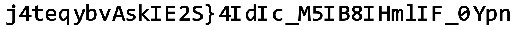
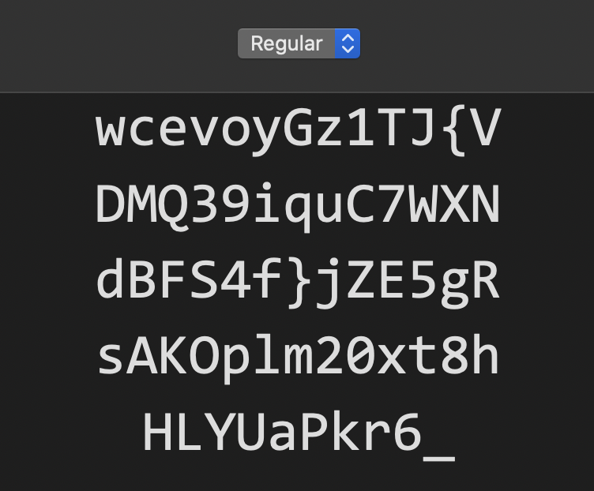

# Misc - Mirage

## Challenge
"Your eyes can deceive you; don't trust them."
-- Obi-Wan Kenobi

https://mirage.hexionteam.com

Author: Idan

## Solution
On the page we can see picture:


Page source looks like:
```
<html>
    <head>
        <title></title>
    </head>
    <style>
        .centered {
            position: fixed;
            top: 50%;
            left: 50%;
            transform: translate(-50%, -50%);
        }

        @font-face {
            font-family: hexFont;
            src: url("assets/hexfont.ttf");
        }

        input {
            font-family: hexFont;
            font-size: 40px;
            font: url
        }
    </style>
    <body>
        <div class="centered" style="text-align: center;">
            
            <br>
            <input></input>
        </div>
    </body>
</html>
```

Besides `flag.png`, there is also `hexfont.ttf`.

If we open `hexfont.ttf`, you can see unstandard font:


It looks like we can decode flag:

hexfont     : `wcjvoyGz1TJ{VDMQ39iquC7WXNdBFS4f}jZE5gRsAKOplm20xt8hHLYUaPkr6_`
normal font : `ABCDEFGHIJKLMNOPQRSTUVWXYZabcdefghijklmnopqrstuvwxyz1234567890`

flag enc : `j4teqybvAskIE2S}4IdIc_M5IB8IHmlIF_0Ypn`
flag dec : `hexCTF{Don7_judge_a_B0Ok_by_1ts_c0v3r}`

## Flag
```
hexCTF{Don7_judge_a_B0Ok_by_1ts_c0v3r}
```
