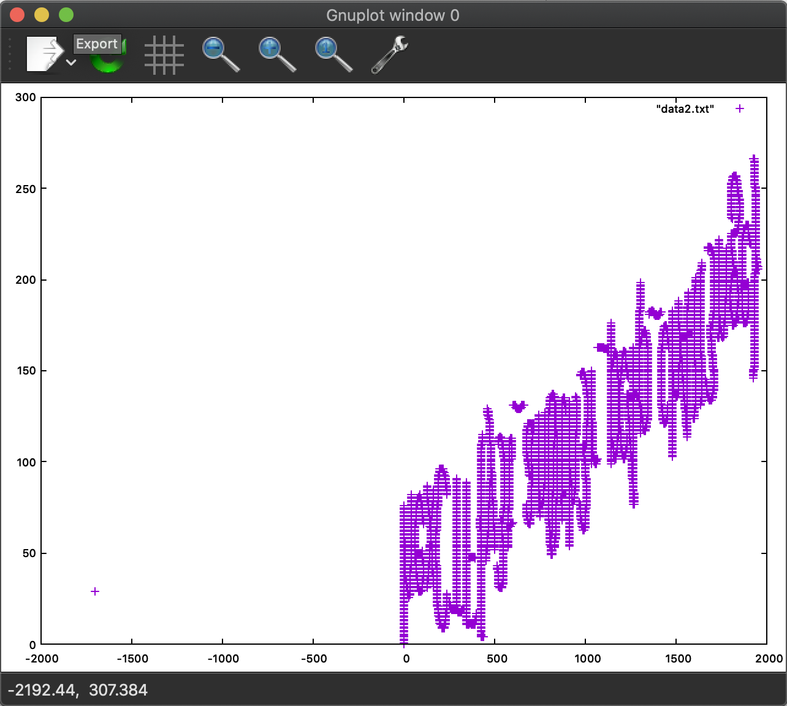
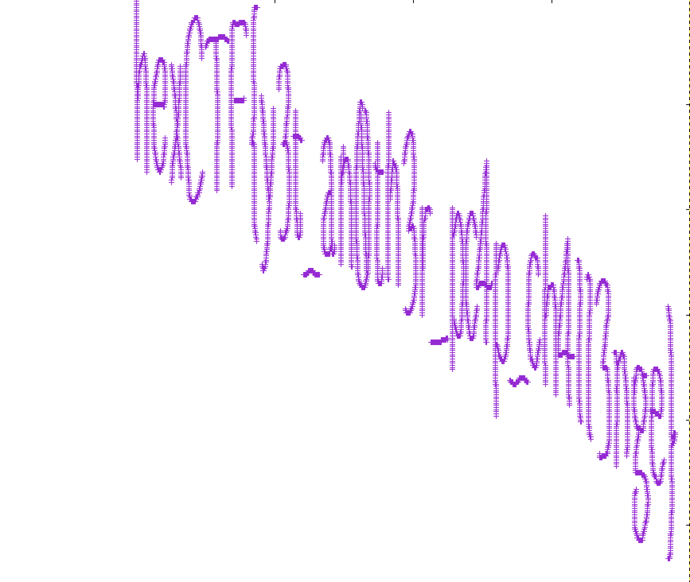

# Misc - T&J

## Challenge
Can you help Tom catch Jerry?

Author: Idan


## Solution
This is very similar challenge to: https://www.rootusers.com/google-ctf-2016-forensic-for2-write-up/

```
tshark -r jerry.pcapng -Y 'usb.capdata && usb.data_len == 8' -T fields -e usb.capdata | sed 's/../:&/g' | sed 's/^://' > data.txt
01:00:00:00:00:00:00:00
01:00:01:00:00:00:01:00
01:00:01:00:00:00:01:00
01:00:01:00:00:00:01:00
01:00:01:00:00:00:01:00
01:ff:00:00:ff:ff:00:00
01:00:01:00:00:00:01:00
01:00:01:00:00:00:01:00
01:00:01:00:00:00:01:00
01:00:01:00:00:00:01:00
01:00:01:00:00:00:01:00
01:ff:00:00:ff:ff:00:00
01:00:01:00:00:00:01:00
[...]
```

If we use the same trick and convert output:
```
awk -F: 'function comp(v){if(v>127)v-=256;return v}{x+=comp(strtonum("0x"$2));y+=comp(strtonum("0x"$3))}$1=="01"{print x,y}' data.txt > data2.txt
```

We can use gnuplot to graph it:
```
➜  ~ gnuplot

  G N U P L O T
  Version 5.2 patchlevel 8    last modified 2019-12-01

  Copyright (C) 1986-1993, 1998, 2004, 2007-2019
  Thomas Williams, Colin Kelley and many others

  gnuplot home:     http://www.gnuplot.info
  faq, bugs, etc:   type "help FAQ"
  immediate help:   type "help"  (plot window: hit 'h')

Terminal type is now 'qt'
gnuplot> plot "data2.txt"
qt.qpa.fonts: Populating font family aliases took 171 ms. Replace uses of missing font family "Sans" with one that exists to avoid this cost.
```

Output:


That looks almost like a flag, lets flip it few times:


## Flag
```
hexCTF{y3t_an0th3r_pc4p_ch4ll3nge}
```
